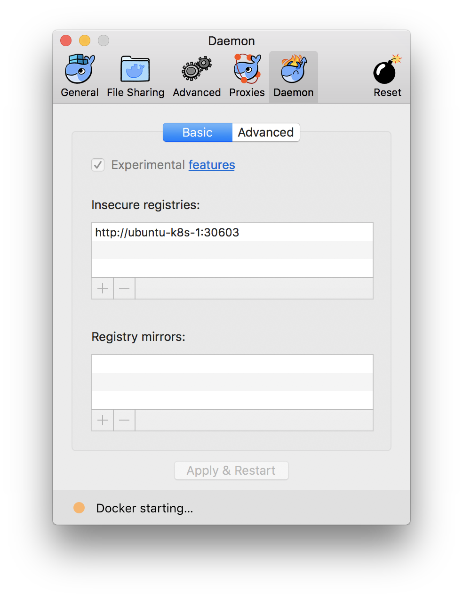

# Kubernetes workshop

Check out or github page [here](https://knowit.github.io/kubernetes-workshop/)

## For masters

### Install helm

```bash
kubectl create serviceaccount tiller --namespace default
kubectl create clusterrolebinding tiller --clusterrole=cluster-admin --serviceaccount=default:tiller
helm init --service-account tiller --tiller-namespace=default
```

### Install nginx ingress controller

```bash
helm install stable/nginx-ingress --set rbac.create=true --set controller.service.type=ClusterIP --tiller-namespace=default
```

### Setup a nginx for students to reach in step 10-service-discovery.

```
kubectl create namespace sample-namespace
kubectl create deployment hello-nginx --image=ubuntu-k8s-1.local:nginx-curl --namespace sample-namespace
kubectl expose deployment my-nginx --port 8086 --target-port 80 --namespace sample-namespace
```

## For students

### Access our fileshare

It is hosted at `ubuntu-k8s-1` and uses FTP.

- Username: ftpuser
- Password: same as Wifi

### Install kubectl

Get the kubectl binary for your platform from our fileshare. It is located under `tools/k8s/kubectl/<platform>/kubectl`.

Make it executable, place it somewhere, and add that somewhere to `PATH`.

### Install kubectl configuration

Someone will supply you with a configuration file.

Place it in a suitable location, such as `~/.kube/workshop_config`.

Point the environment variable `KUBECONFIG` to your configuration

```bash
export KUBECONFIG=$HOME/.kube/workshop_config
```

Check with kubectl that the configuration works

```bash
kubectl config view
```

### (Optional) Install helm binary

Get the binary from `tools/k8s/helm` in this repo.

Make it executable, place it somewhere, and add that somewhere to `PATH`.

### Enable insecure registries for Docker

Add `http://ubuntu-k8s-1:30603` as an insecure registry, as described below.

### Linux

```bash
sudo nano /etc/docker/daemon.json
```

Insert this content:

```
{
  "insecure-registries" : ["ubuntu-k8s-1.local:30603"]
}
```

Then:

```bash
systemctl restart docker
```

#### On macOS

Click on the Docker icon in the menu bar (the bar on the top of your screen), choose Preferences... and make the Daemon tab look like the image below


