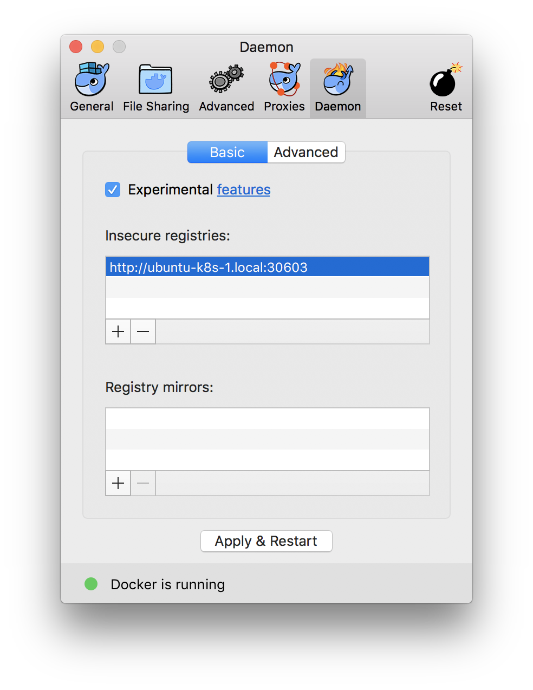

## Access our fileshare

It is hosted at `ubuntu-k8s-1` and uses FTP.

- Username: ftpuser
- Password: same as Wifi

## Install kubectl

Get the kubectl binary for your platform from our fileshare. It is located under `kubernetes-workshop/tools/k8s/kubectl/<platform>/kubectl`.

Make it executable, place it somewhere, and add that somewhere to `PATH`.

## Install kubectl configuration

A kubectl configuration file should have generated for you. It is located at the fileshare under `kube_configs`. Find the onie with your name in the filename.

Place it at `~/.kube/workshop_config`.

Point the environment variable `KUBECONFIG` to your configuration

```bash
export KUBECONFIG=$HOME/.kube/workshop_config
```

Check with kubectl that the configuration works

```bash
kubectl config view
```

## (Optional) Install helm binary

Get the helm binary for your platform from our fileshare. It is located under `kubernetes-workshop/tools/k8s/helm`.

Make it executable, place it somewhere, and add that somewhere to `PATH`.

## Enable insecure registries for Docker

Add `http://ubuntu-k8s-1:30603` as an insecure registry, as described below.

### Linux

```bash
sudo nano /etc/docker/daemon.json
```

Insert this content:

```
{
  "insecure-registries" : ["ubuntu-k8s-1.local:30603"]
}
```

Then:

```bash
systemctl restart docker
```

### On macOS

Click on the Docker icon in the menu bar (the bar on the top of your screen), choose Preferences... and make the Daemon tab look like the image below




