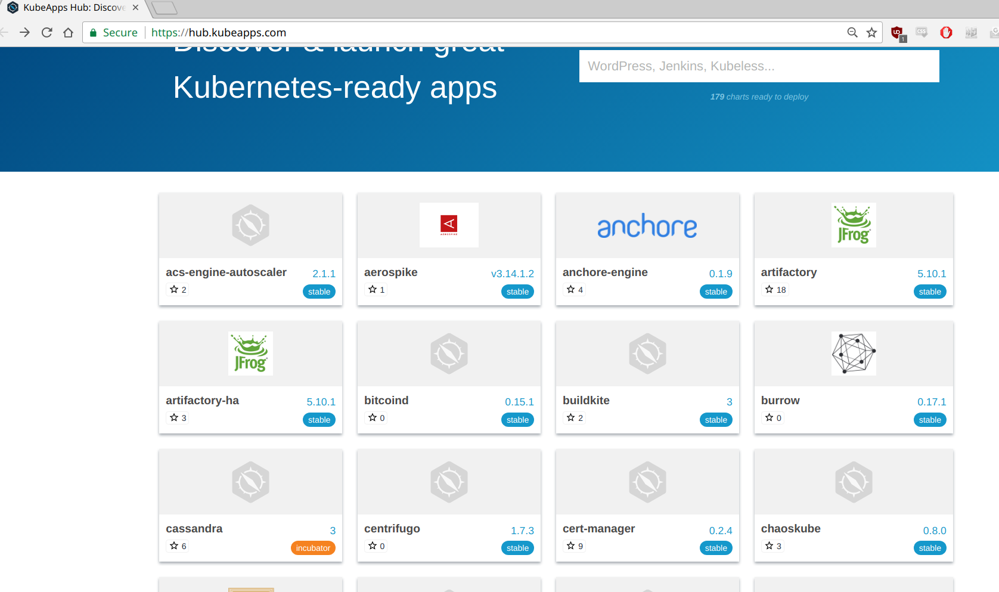

Kubernetes Helm is a package manager for Kubernetes. With helm you can simply do

```
helm install stable/mongodb
```

to deploy the MongoDB in the current namespace. A package in Helm is called a Chart, by the way.

Without helm, you would need to run `kubectl apply -f .` in a directory containing all the YAML files needed
for your application to run. And if you want to deploy your app to different namespaces, but with slightly
different configuration, you would need one YAML file per configuration. In contrast, in Helm you can do

```
helm install stable/mongodb --set mongodbUsername=root --set mongodbPassword=foo
```

or 

```
helm install stable/mongodb -f values.yaml
```

to configure the Mongodb chart.

## Task: Setup Helm and install a chart

Helm has been installed to our Kubernets cluster already, but you need to initialize Helm by running

`helm init --client-only`

Then we need to add a repository we have setup in our cluster:

`helm repo add myrepo http://ubuntu-k8s-1.local:30654`

A repository is a collection of charts.

Let's see if we can find the nginx chart:

`helm search nginx`

```
NAME            VERSION DESCRIPTION                                       
myrepo/nginx            0.1.0   A basic NGINX HTTP server 
```

Yup, there it is. Let's install it:

`helm install myrepo/nginx`

Then run `kubectl get po`, `kubectl get svc` and `kubectl get configmap` to see that helm has installed
various resources for nginx.

Let's look at the running charts:

```
$ helm ls
NAME                  REVISION  UPDATED                   STATUS          CHART             NAMESPACE  
original-bird         1         Thu Apr 26 19:08:52 2018  DEPLOYED        nginx-0.1.0       yngvar     
```

When you're done, delete the chart:

`helm delete original-bird`

## Repository browser

There's a bunch of ready charts at http://kubeapps.com:



It's possible to install your own "kubeapps", that is, a repository. Then you have a very simple way of 
browsing the various applications in your organization.

